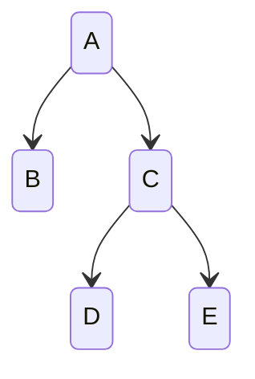

# 관계형 데이터베이스의 계층적 데이터 모델링
> https://www.slideshare.net/slideshow/models-for-hierarchical-data/4179181

1. 인접 리스트(Adjacency List)
2. 경로 나열(Path Enumeration)
3. 중첩 집합(Nested Set)
4. 클로저 테이블(Closure Table)

| 구분       | 테이블 수 | 자식(Child) 노드 조회 | 하위 노드 모두 조회 | 노드 추가 | 노드 삭제 | 경로 변경 | 참조 무결성 |
|----------|-----------|-----------------|-------------|-------|-------|-------|--------|
| 인접 리스트   | 1 | 쉬움              | 어려움         | 쉬움    | 쉬움    | 쉬움    | 보장     |
| 경로 나열    | 1 | 어려움            | 쉬움         | 쉬움    | 쉬움    | 어려움  | 보장 못함  |
| 중첩 집합    | 1 | 어려움              | 쉬움         | 어려움  | 어려움  | 어려움  | 보장 못함  |
| 클로저 테이블  | 2 | 쉬움            | 쉬움         | 쉬움    | 쉬움    | 쉬움    | 보장     |

<br>

## 1. 인접 리스트(Adjacency List)
`parent_id` 컬럼을 추가하여 부모-자식 관계를 표현하는 방법

재귀형 쿼리(`WITH RECURSIVE`) 또는 계층형 쿼리(`CONNECT BY`)를 통해 조회
- 대부분의 DB에서는 재귀형 쿼리 이용 (MySQL은 8.0 버전부터 재귀형 쿼리 지원)
- Oracle은 `CONNECT BY`를 통해 계층형 쿼리 사용



| id | name | parent_id |
|----|------|-----------|
| 1  | A    | NULL      |
| 2  | B    | 1         |
| 3  | C    | 1         |
| 4  | D    | 3         |
| 5  | E    | 3         |

### 조회
아래와 같이 C와 C의 하위 노드들을 조회할 수 있음
```sql
WITH RECURSIVE cte AS (
    SELECT id, name, parent_id
    FROM category
    WHERE id = 3
    UNION ALL
    SELECT c.id, c.name, c.parent_id
    FROM category c
    JOIN category_path cp ON c.id = cp.parent_id
)
SELECT * FROM cte;
```

### 삽입
```sql
INSERT INTO category (name, parent_id) VALUES ('F', 2);
```

### 이동
```sql
UPDATE category SET parent_id = 2 WHERE id = 4;
```


### 삭제
```sql
DELETE FROM category WHERE id = 4;
```

<br>

## 2. 경로 나열(Path Enumeration)
브레드 크럼(Breadcrumbs)에 용이
- 브레드 크럼: 주로 페이지 상단 좌측에 자리하여 유저가 웹사이트 내에서 어디에 있는지 알려주는 네비게이션 텍스트

상위 경로를 업데이트할 때마다 모든 자식 노드의 경로를 업데이트해야 함

구분자(e.g. `/`)를 처리하기 위한 비용 발생 


| id | name | path   |
|----|------|--------|
| 1  | A    | 1/     |
| 2  | B    | 1/2/   |
| 3  | C    | 1/3/   |
| 4  | D    | 1/3/4/ |
| 5  | E    | 1/3/5/ |

### 조회
아래와 같이 C와 C의 하위 노드들을 조회할 수 있음
```sql
SELECT *
FROM category
WHERE path LIKE '1/3/%';
```

### 삽입
```sql
INSERT INTO category (id, name, path) VALUES (6, 'F', '1/2/6/');
```

### 이동
```sql
UPDATE category SET path = REPLACE(path, '1/3/', '1/2/') WHERE path LIKE '1/3/%';
```

### 삭제
```sql
DELETE FROM category WHERE path LIKE '1/3/%';
```

<br>

## 3. 중첩 집합(Nested Set)
모든 노드에 대해 left, right 숫자를 부여
- left 숫자는 모든 자식 노드의 숫자보다 작아야 함
- right 숫자는 모든 자식 노드의 숫자보다 커야 함
- 노드(id)의 숫자는 부모 노드들의 숫자 사이에 있어야 함

자식 노드 조회 시, 부모 노드의 left, right 숫자 사이에 있는 노드들을 조회하면 됨

자식 노드 수정 시 부모 노드들의 left, right 숫자를 업데이트해야 함


| id | name | left | right |
|----|------|------|-------|
| 1  | A    | 1    | 10    |
| 2  | B    | 2    | 3     |
| 3  | C    | 4    | 9     |
| 4  | D    | 5    | 6     |
| 5  | E    | 7    | 8     |

### 조회
아래와 같이 C와 C의 하위 노드들을 조회할 수 있음
```sql
SELECT * 
FROM category parent
JOIN category descendants ON descendants.left BETWEEN parent.left AND parent.right
WHERE parent.id = 3;
```

### 삽입
```sql
UPDATE category
SET
    left = CASE WHEN left >= 4 THEN left + 2 ELSE left END,
    right = right + 2
WHERE right >= 3;

INSERT INTO category (name, left, right) VALUES ('F', 3, 4);
```

### 이동
```sql
UPDATE category
SET
    left = CASE WHEN left >= 5 THEN left - 2 ELSE left END,
    right = CASE WHEN right >= 6 THEN right - 2 ELSE right END
WHERE left >= 5 AND right <= 6;
```

### 삭제
```sql
DELETE FROM category WHERE left >= 5 AND right <= 6;

UPDATE category
SET
    left = CASE WHEN left > 4 THEN left - 2 ELSE left END,
    right = right - 2
WHERE right >= 3;
```

<br>

## 4. 클로저 테이블(Closure Table)
경로를 위한 별도의 테이블을 생성하여 부모-자식 관계를 표현하는 방법

자기 자신을 포함(ancestor = descendant)하여 자식 노드 정보를 모두 저장
- paths 테이블은 O(n^2)의 레코드를 가짐

경로 테이블에 depth 컬럼을 추가하여 부모-자식 관계의 깊이를 표현할 수도 있음


category 테이블

| id | name |
|----|------|
| 1  | A    |
| 2  | B    |
| 3  | C    |
| 4  | D    |
| 5  | E    |

category_paths 테이블

| ancestor | descendant | depth |
|----------|------------|-------|
| 1        | 1          | 0     |
| 1        | 2          | 1     |
| 1        | 3          | 1     |
| 1        | 4          | 2     |
| 1        | 5          | 2     |
| 3        | 3          | 0     |
| 3        | 4          | 1     |
| 3        | 5          | 1     |

### 조회
아래와 같이 C와 C의 모든 하위 노드들을 조회할 수 있음
```sql
SELECT *
FROM category c
JOIN category_paths cp ON c.id = cp.descendant
WHERE cp.ancestor = 3;
```

### 삽입
```sql
INSERT INTO category (id, name) VALUES (6, 'F');

INSERT INTO category_paths (ancestor, descendant, depth)
SELECT ancestor, 6, depth + 1
FROM category_paths
WHERE descendant = 3
UNION ALL SELECT 6, 6, 0;
```

### 삭제
```sql
DELETE FROM category_paths WHERE descendant = 4;
```